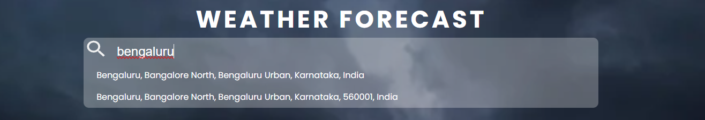
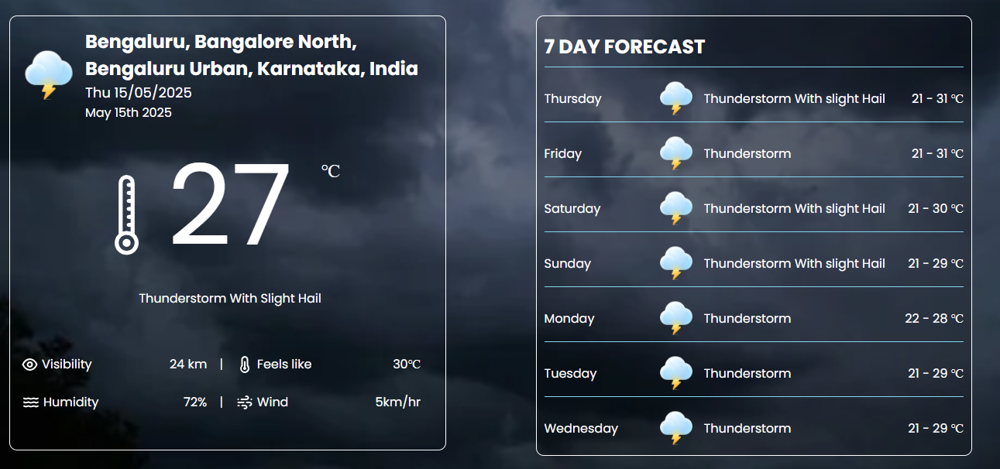
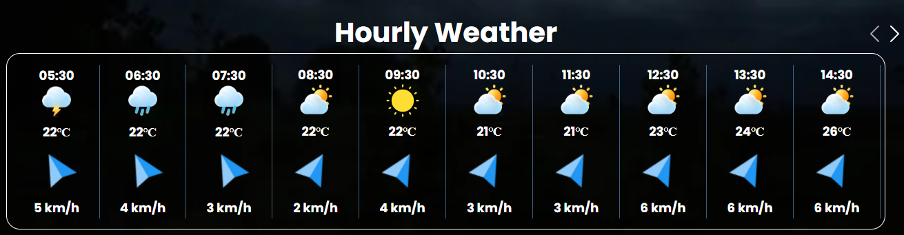

# 🌤️ Weather Forecast

A responsive weather application built with **ReactJS** and the **Open-Meteo Weather API** that displays current weather, 7-day forecasts, and hourly forecasts for the current day.

---

## ✅ Features

- 🔍 Search for a city name to load weather data.
- 🌡️ View:
  - Current weather data.
  - 7-day weather forecast.
  - 24-hour hourly weather forecast from **5:30 AM to 11:30 PM**.
- 🕒 Highlights the current hour in the hourly forecast.
- 🌤️ Shows **weather condition icons** based on forecast data.
- 🌡️ All temperatures are shown in **Celsius**.
- 💧 Displays **humidity, wind speed, and pressure** for each forecast.

---

## 🧰 Technologies Used

- 🖥️ **Frontend:**
  - ReactJS
  - JavaScript
  - HTML5 & CSS3

- 🔗 **API:**
  - [Open-Meteo Weather Forecast API](https://open-meteo.com/)

- 📦 **NPM Packages:**
  - `openmeteo` – for fetching weather data.
  - `moment` – for formatting and managing date/time.

---

## 🛠️ Installation & Setup

1. 📦 Download or clone this repository.
2. 🗂️ Extract the `.zip` (if downloaded).
3. 🔍 Open a terminal and navigate into the project folder:
   ```bash
   cd your-project-folder
4. 📥 Install the dependencies:
    ```bash
    npm install.
5. 🚀 Run the project using Vite:
    ```bash
    npm run dev
6. 🌐 Open your browser and go to the local URL shown (e.g., http://localhost:5173).

---

## 🌍 Live Demo
🔗 [Click here to view the weather app](https://openmeteo-weather-forecast.netlify.app/)

---

## 🖼️ Screenshot

### Default Weather Forecast Screen


### Search City


### Current and 7-Seven Days Weather Forecast Details


### Hourly Weather Forecast Of Current Day


---

## 🌱 Future Improvements
- 🗺️ Add a map to show the searched location.
- 📈 Display weather data using graphs and charts.

---

## 🙏 Acknowledgements
- 🌐 Open-Meteo API
- ⏰ Moment.js

